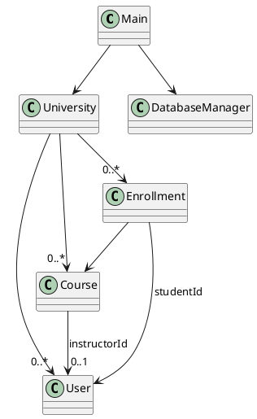

# University Management System

A Java Swing desktop application for managing university data — users (students, faculty, admin), courses, departments, and enrollments — with persistent storage in SQLite and CSV import/export. The UI features a colorful modern theme and role-based dashboards for students, faculty, admin staff, and system administrators.

---

## Features

- **Role-based Login**: Student, Faculty, AdminStaff, SystemAdmin
- **Student registration** (self-service)
- **User Management**: View, edit, delete, import/export users (SystemAdmin only)
- **Course Management**: Create, edit, delete, import/export courses (SystemAdmin only)
- **Enrollments**: Request, approve, assign grade, import/export enrollments (SystemAdmin only; Faculty can assign grades)
- **Departments**: Manage departments and their relationships
- **Colorful UI**: Modern, accessible color palette and table highlights
- **CSV import/export**: For courses, users, and enrollments
- **Database-backed**: All data persisted in SQLite via JDBC
- **File backup**: FileManager supports text-based backup/fallback

---

## Quick Start

### Prerequisites

- Java 8+ (Java 11 recommended)
- [sqlite-jdbc](https://github.com/xerial/sqlite-jdbc) JAR in `lib/` (e.g. `lib/sqlite-jdbc-3.49.1.0.jar`)

### Compile

Linux/macOS:
```sh
javac -cp ".:lib/*" university/management/system/*.java
```
Windows:
```sh
javac -cp ".;lib/*" university\management\system\*.java
```

### Run

Linux/macOS:
```sh
java -cp ".:lib/*" university.management.system.Main
```
Windows:
```sh
java -cp ".;lib/*" university.management.system.Main
```

---

## Usage

- On first run, a default SystemAdmin account is created:  
  **Username:** `admin`  
  **Password:** `admin123`
- Login as admin, create courses, users, and departments.
- Students can self-register and request enrollments.
- Faculty can assign grades for their courses.
- SystemAdmin can use import/export buttons to manage data in CSV format.

---

## Database Schema (Simplified)

- **users**: `id`, `role`, `username`, `passwordHash`, `salt`, `name`, `email`, `admissionDate`, `academicStatus`, `department`, `expertise`, `staffRole`, `securityLevel`
- **courses**: `code`, `title`, `description`, `creditHours`, `maxEnrollment`, `prereqCsv`, `instructorId`, `schedule`
- **departments**: `id`, `name`, `facultyCsv`, `coursesCsv`
- **enrollments**: `id`, `studentId`, `courseCode`, `enrollmentDate`, `grade`, `status`

---

## CSV Import/Export

- **Courses:** `code,title,description,creditHours,prereqCsv,instructorId,maxEnrollment,schedule`
- **Users:** `id,role,username,passwordHash,salt,name,email,admissionDate,academicStatus,department,expertise,staffRole,securityLevel`
- **Enrollments:** `studentId,courseCode,enrollmentDate,grade,status`

> Import/export is available only to SystemAdmins for security.

---

## Roles & Permissions

| Role         | Dashboard      | Courses CRUD | Users CRUD | Enrollments CRUD | Grade Assign | CSV Import/Export |
|--------------|---------------|--------------|------------|------------------|--------------|-------------------|
| Student      | ✓             | —            | —          | request/withdraw | —            | —                 |
| Faculty      | ✓             | —            | —          | own courses      | ✓            | —                 |
| AdminStaff   | ✓             | —            | —          | approve/request  | —            | —                 |
| SystemAdmin  | ✓             | ✓            | ✓          | ✓                | —            | ✓                 |

---

## Screenshots

> *(Add your screenshots here for login, dashboard, courses panel, etc.)*

---

## Simple Class Diagram



---

## Known Issues

- CSV user export includes password hashes (for internal backup only).
- In-memory model update replaces objects; if external code keeps references, fields may desync.
- Only SystemAdmin can use CSV/data-destructive actions for safety. Extend `isFullAccess()` if you want to allow more roles.

---

## License

MIT License (add your own if needed)

---

## Credits

Developed by YoussefElshity and contributors.  
UI, DB, and CSV enhancements by assistant.
